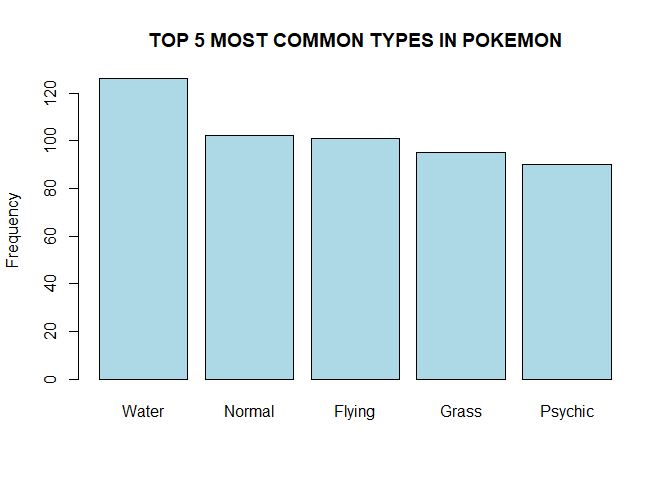
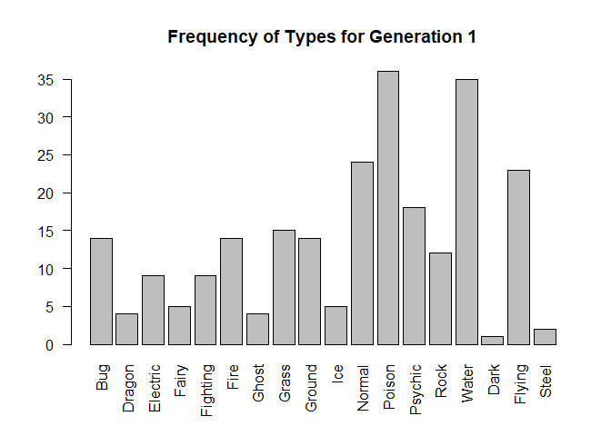
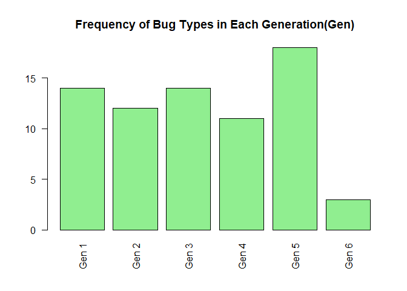
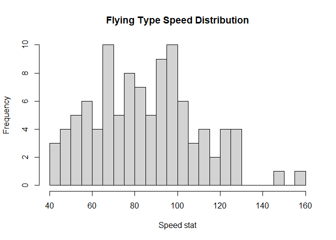
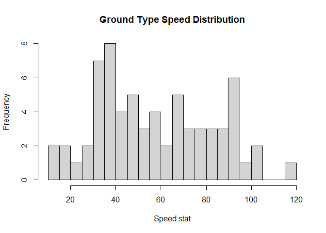
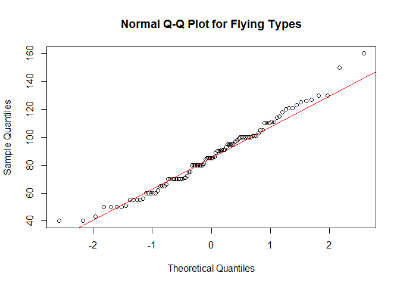
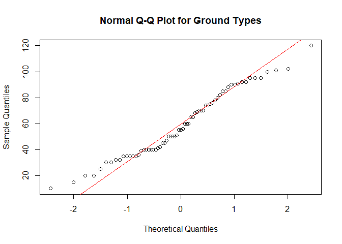

Dashboard
================
2025-01-25

## Welcome to the World of Pokemon

``` r
library(datasets)
```

First lets bring in the Pokemon dataset.

``` r
Pokemon = read.csv(file = 'data/Pokemon.csv')
head(Pokemon)
```

    ##   X.                  Name Type.1 Type.2 Total HP Attack Defense Sp..Atk
    ## 1  1             Bulbasaur  Grass Poison   318 45     49      49      65
    ## 2  2               Ivysaur  Grass Poison   405 60     62      63      80
    ## 3  3              Venusaur  Grass Poison   525 80     82      83     100
    ## 4  3 VenusaurMega Venusaur  Grass Poison   625 80    100     123     122
    ## 5  4            Charmander   Fire          309 39     52      43      60
    ## 6  5            Charmeleon   Fire          405 58     64      58      80
    ##   Sp..Def Speed Generation Legendary
    ## 1      65    45          1     False
    ## 2      80    60          1     False
    ## 3     100    80          1     False
    ## 4     120    80          1     False
    ## 5      50    65          1     False
    ## 6      65    80          1     False

<br> <br>

### Reasearch Question 1:

**What is the most common type for pokemon?**

Since there are secondary typing for Pokemon, we will have to combine
the observations from the two variables.

<br>

But first lets see what the data shows for Pokemon that only have one
type.

``` r
# this is the Type.2 for charmander
# a Pokemon that has a singular "Fire" type

Pokemon$Type.2[5]
```

    ## [1] ""

The data displays a “” or empty for a Pokemon that has to Type.2. This
will muddy our data if we’re looking for the most common type, since
technically “” is a valid observation as far as the code is concerned.

<br>

These are the tables for Type.1 and Type.2 variables.

``` r
table(Pokemon$Type.1)
```

    ## 
    ##      Bug     Dark   Dragon Electric    Fairy Fighting     Fire   Flying 
    ##       69       31       32       44       17       27       52        4 
    ##    Ghost    Grass   Ground      Ice   Normal   Poison  Psychic     Rock 
    ##       32       70       32       24       98       28       57       44 
    ##    Steel    Water 
    ##       27      112

``` r
table(Pokemon$Type.2)
```

    ## 
    ##               Bug     Dark   Dragon Electric    Fairy Fighting     Fire 
    ##      386        3       20       18        6       23       26       12 
    ##   Flying    Ghost    Grass   Ground      Ice   Normal   Poison  Psychic 
    ##       97       14       25       35       14        4       34       33 
    ##     Rock    Steel    Water 
    ##       14       22       14

``` r
# how many types are in Type.1
length(table(Pokemon$Type.1)) 
```

    ## [1] 18

``` r
# how many types are in Type.2
length(table(Pokemon$Type.2))
```

    ## [1] 19

As you can see there is an extra type in `table(Pokemon$Type.2)` that is
“” with the number 386 to represent all of the observations/Pokemon with
“” for Type.2.

<br> This is the combined table of Type.1 and Type.2, minus the empty “”
type. Now we need to be careful, because this does not represent every
Pokemon. As you can see when we look at the sum of the table, it shows
1214 when we only have 800 observations/Pokemon.

``` r
combinedTypeTable = (table(Pokemon$Type.1) + table(Pokemon$Type.2)[-1])

combinedTypeTable
```

    ## 
    ##      Bug     Dark   Dragon Electric    Fairy Fighting     Fire   Flying 
    ##       72       51       50       50       40       53       64      101 
    ##    Ghost    Grass   Ground      Ice   Normal   Poison  Psychic     Rock 
    ##       46       95       67       38      102       62       90       58 
    ##    Steel    Water 
    ##       49      126

``` r
paste("The sum is: ", sum(combinedTypeTable))
```

    ## [1] "The sum is:  1214"

Finally lets see which type is the most common for pokemon, either as
their Type.1 OR their Type.2.

``` r
# finds the max(table), and then finds the index of the max value, then returns both the number and its name, in our case the type

combinedTypeTable[which(combinedTypeTable == max(combinedTypeTable))]
```

    ## Water 
    ##   126

**As you can see, the most common typing for a Pokemon is Water.**

But as always a visualization will help in contextualizing this piece of
information.

``` r
combinedTypeTable = sort(combinedTypeTable, decreasing=TRUE)
barplot(combinedTypeTable[1:5], main = "TOP 5 MOST COMMON TYPES IN POKEMON", ylab="Frequency", col=c("lightblue"))
```

<!-- -->

<br> <br>

### Reasearch Question 2: \*ADD A “Total” Option to the Final Graph that Shows Total Amount of that Type

**What generation has the greatest number of each “type”(Type.1 and
Type.2 combined) of Pokemon**

<br>

First we need to know how many different generations are present in our
data.

``` r
table(Pokemon$Generation)
```

    ## 
    ##   1   2   3   4   5   6 
    ## 166 106 160 121 165  82

There are 6 different generations of Pokemon listed in the data, with a
varying number of Pokemon for each generation.

Now we need to parse the data so that we can see how many of each type
is in each generation.

``` r
# table for the number of each Type.1 type for all entries where the Generation is 1
table(Pokemon$Type.1[which(Pokemon$Generation == 1)])
```

    ## 
    ##      Bug   Dragon Electric    Fairy Fighting     Fire    Ghost    Grass 
    ##       14        3        9        2        7       14        4       13 
    ##   Ground      Ice   Normal   Poison  Psychic     Rock    Water 
    ##        8        2       24       14       11       10       31

``` r
# table for the number of each Type.2 type for all entries where the Generation is 1
table(Pokemon$Type.2[which(Pokemon$Generation == 1)])
```

    ## 
    ##              Dark   Dragon    Fairy Fighting   Flying    Grass   Ground 
    ##       88        1        1        3        2       23        2        6 
    ##      Ice   Poison  Psychic     Rock    Steel    Water 
    ##        3       22        7        2        2        4

``` r
length(table(Pokemon$Type.1[which(Pokemon$Generation == 1)]))
```

    ## [1] 15

``` r
length(table(Pokemon$Type.2[which(Pokemon$Generation == 1)]))
```

    ## [1] 14

But we run in to a problem due to the way that Pokemon types are set up.
A Pokemon has one or two types, and the Type.2 is valued the same as
Type.1. This means that we need to count both when looking at how many
types of each Pokemon are in each generation. For example the first
Pokemon in the data, Bulbasaur, would count as both a “Grass” and
“Poison” type, with both holding equal weight. This causes discrepancies
like we see above, where some types are missing from the Type.2 table
and the Type.1 table . We will have to modify the table ourselves to
make this work.

<br>

Since we will most likely have to do this for every generation, lets
make a function that fills in the missing “types” and returns one vector
with the combined values for both Type.1 and Type.2

``` r
# this function will help us combine the two Type tables int o one table with all unique types from both Type.1 and Type.2, as well as add up duplicates


combineTypeTblByGen = function(generation){
  
  # merging the table of Type.1 and Type.2 for the generation
  mergedTypeTable = merge(table(Pokemon$Type.1[which(Pokemon$Generation == generation)]), table(Pokemon$Type.2[which(Pokemon$Generation == generation)])[-1], all= TRUE)
  
  
  # vector version of the merged tables above
  typeVec = mergedTypeTable[[2]]
  names(typeVec) = mergedTypeTable[[1]]
  
  
  
  # for loop that adds up the repeat values for the types, and then removes the duplicate name+value from the vector
  len = length(typeVec) - 1
  for(i in 1:len){
  
    if(i >= length(typeVec)){break}
  
    else if(names(typeVec[i]) == names(typeVec[i + 1])){

      typeVec[i+1] = typeVec[i] + typeVec[i+1]
      #print(typeVec[i])

      typeVec = typeVec[-c(i)]
  
    }

  }
  
  return(typeVec)
  
  
}


barplot(combineTypeTblByGen(1), las=2, main="Frequency of Types for Generation 1")
```

<!-- -->

The plot above combines frequency of “types” in both Type1 and Type2 for
generation 1, and because we have the function combineTypeTblByGen() we
are able to replicate this for every other generation as well.

<br>

Since we have the combined tables for every generation, we can move on
to comparing the generations by Type.

This next function will allow us to see how many of one specific type is
in every generation. For example it will allow us to see the number of
“Bug” types there are in generation 1 through 6.

``` r
# function takes in a character argument that represents a Pokemon Type and returns a vector of length 6, with each index representing the number of that type of pokemon are in that generation number

compareTypeAcrossGen = function(type){
  
  oneTypeAllGensVec = c()
  
  for(i in 1:6){
    
    #print(combineTypeTblByGen(i)[type])
    
    oneTypeAllGensVec[i] = combineTypeTblByGen(i)[type]
   
    
  }

  names(oneTypeAllGensVec) = c("Gen 1", "Gen 2", "Gen 3", "Gen 4", "Gen 5", "Gen 6")
  
  return(oneTypeAllGensVec)

}


compareTypeAcrossGen("Bug")
```

    ## Gen 1 Gen 2 Gen 3 Gen 4 Gen 5 Gen 6 
    ##    14    12    14    11    18     3

``` r
compareTypeAcrossGen("Dark")
```

    ## Gen 1 Gen 2 Gen 3 Gen 4 Gen 5 Gen 6 
    ##     1     8    13     7    16     3

``` r
barplot(compareTypeAcrossGen("Bug"), main="Frequency of Bug Types in Each Generation(Gen)", las=2, col = "lightgreen")
```

<!-- -->

We have the comparisons across generations for individual types, but
that doesn’t accomplish anything unless we want to create 18 different
barplots. Instead lets use the plotly package to create an interactive
barplot that shows the frequency of each type across the generations to
get a broader understanding of the dataset.

``` r
typeByGenTraces[]
```

    ## [[1]]
    ## Gen 1 Gen 2 Gen 3 Gen 4 Gen 5 Gen 6 
    ##    14    12    14    11    18     3 
    ## 
    ## [[2]]
    ## Gen 1 Gen 2 Gen 3 Gen 4 Gen 5 Gen 6 
    ##     4     2    15     4    12     9 
    ## 
    ## [[3]]
    ## Gen 1 Gen 2 Gen 3 Gen 4 Gen 5 Gen 6 
    ##     9     9     5    12    12     3 
    ## 
    ## [[4]]
    ## Gen 1 Gen 2 Gen 3 Gen 4 Gen 5 Gen 6 
    ##     5     8     8     1     3    14 
    ## 
    ## [[5]]
    ## Gen 1 Gen 2 Gen 3 Gen 4 Gen 5 Gen 6 
    ##     9     2     9    10    17     4 
    ## 
    ## [[6]]
    ## Gen 1 Gen 2 Gen 3 Gen 4 Gen 5 Gen 6 
    ##    14    11     9     6    16     8 
    ## 
    ## [[7]]
    ## Gen 1 Gen 2 Gen 3 Gen 4 Gen 5 Gen 6 
    ##     4     1     8     9     9    15 
    ## 
    ## [[8]]
    ## Gen 1 Gen 2 Gen 3 Gen 4 Gen 5 Gen 6 
    ##    15    10    18    17    20    15 
    ## 
    ## [[9]]
    ## Gen 1 Gen 2 Gen 3 Gen 4 Gen 5 Gen 6 
    ##    14    11    16    12    12     2 
    ## 
    ## [[10]]
    ## Gen 1 Gen 2 Gen 3 Gen 4 Gen 5 Gen 6 
    ##     5     5     7     8     9     2 
    ## 
    ## [[11]]
    ## Gen 1 Gen 2 Gen 3 Gen 4 Gen 5 Gen 6 
    ##    24    15    18    18    19     4 
    ## 
    ## [[12]]
    ## Gen 1 Gen 2 Gen 3 Gen 4 Gen 5 Gen 6 
    ##    36     4     5     8     7     2 
    ## 
    ## [[13]]
    ## Gen 1 Gen 2 Gen 3 Gen 4 Gen 5 Gen 6 
    ##    18    10    28    10    16     8 
    ## 
    ## [[14]]
    ## Gen 1 Gen 2 Gen 3 Gen 4 Gen 5 Gen 6 
    ##    12     8    12     7    10     9 
    ## 
    ## [[15]]
    ## Gen 1 Gen 2 Gen 3 Gen 4 Gen 5 Gen 6 
    ##    35    18    31    15    18     9 
    ## 
    ## [[16]]
    ## Gen 1 Gen 2 Gen 3 Gen 4 Gen 5 Gen 6 
    ##     1     8    13     7    16     3 
    ## 
    ## [[17]]
    ## Gen 1 Gen 2 Gen 3 Gen 4 Gen 5 Gen 6 
    ##    23    19    14    16    21     8 
    ## 
    ## [[18]]
    ## Gen 1 Gen 2 Gen 3 Gen 4 Gen 5 Gen 6 
    ##     2     3    12    12    12     5

``` r
q2FinalGraph
```

<div class="plotly html-widget html-fill-item" id="htmlwidget-24eeb2a73eb9ad62b58f" style="width:672px;height:480px;"></div>
<script type="application/json" data-for="htmlwidget-24eeb2a73eb9ad62b58f">{"x":{"visdat":{"128079f6587":["function () ","plotlyVisDat"]},"cur_data":"128079f6587","attrs":{"128079f6587":{"x":{},"y":{},"marker":{"color":"lightgreen"},"name":"Bug","alpha_stroke":1,"sizes":[10,100],"spans":[1,20],"type":"bar"},"128079f6587.1":{"x":{},"y":[4,2,15,4,12,9],"marker":{"color":"darkblue"},"name":"Dragon","alpha_stroke":1,"sizes":[10,100],"spans":[1,20],"type":"bar","inherit":true},"128079f6587.2":{"x":{},"y":[9,9,5,12,12,3],"marker":{"color":"yellow"},"name":"Electric","alpha_stroke":1,"sizes":[10,100],"spans":[1,20],"type":"bar","inherit":true},"128079f6587.3":{"x":{},"y":[5,8,8,1,3,14],"marker":{"color":"pink"},"name":"Fairy","alpha_stroke":1,"sizes":[10,100],"spans":[1,20],"type":"bar","inherit":true},"128079f6587.4":{"x":{},"y":[9,2,9,10,17,4],"marker":{"color":"brown"},"name":"Fighting","alpha_stroke":1,"sizes":[10,100],"spans":[1,20],"type":"bar","inherit":true},"128079f6587.5":{"x":{},"y":[14,11,9,6,16,8],"marker":{"color":"orangered"},"name":"Fire","alpha_stroke":1,"sizes":[10,100],"spans":[1,20],"type":"bar","inherit":true},"128079f6587.6":{"x":{},"y":[4,1,8,9,9,15],"marker":{"color":"slateblue"},"name":"Ghost","alpha_stroke":1,"sizes":[10,100],"spans":[1,20],"type":"bar","inherit":true},"128079f6587.7":{"x":{},"y":[15,10,18,17,20,15],"marker":{"color":"darkgreen"},"name":"Grass","alpha_stroke":1,"sizes":[10,100],"spans":[1,20],"type":"bar","inherit":true},"128079f6587.8":{"x":{},"y":[14,11,16,12,12,2],"marker":{"color":"khaki"},"name":"Ground","alpha_stroke":1,"sizes":[10,100],"spans":[1,20],"type":"bar","inherit":true},"128079f6587.9":{"x":{},"y":[5,5,7,8,9,2],"marker":{"color":"cyan"},"name":"Ice","alpha_stroke":1,"sizes":[10,100],"spans":[1,20],"type":"bar","inherit":true},"128079f6587.10":{"x":{},"y":[24,15,18,18,19,4],"marker":{"color":"lightgray"},"name":"Normal","alpha_stroke":1,"sizes":[10,100],"spans":[1,20],"type":"bar","inherit":true},"128079f6587.11":{"x":{},"y":[36,4,5,8,7,2],"marker":{"color":"purple"},"name":"Poison","alpha_stroke":1,"sizes":[10,100],"spans":[1,20],"type":"bar","inherit":true},"128079f6587.12":{"x":{},"y":[18,10,28,10,16,8],"marker":{"color":"hotpink"},"name":"Psychic","alpha_stroke":1,"sizes":[10,100],"spans":[1,20],"type":"bar","inherit":true},"128079f6587.13":{"x":{},"y":[12,8,12,7,10,9],"marker":{"color":"tan"},"name":"Rock","alpha_stroke":1,"sizes":[10,100],"spans":[1,20],"type":"bar","inherit":true},"128079f6587.14":{"x":{},"y":[35,18,31,15,18,9],"marker":{"color":"deepskyblue"},"name":"Water","alpha_stroke":1,"sizes":[10,100],"spans":[1,20],"type":"bar","inherit":true},"128079f6587.15":{"x":{},"y":[1,8,13,7,16,3],"marker":{"color":"sienna"},"name":"Dark","alpha_stroke":1,"sizes":[10,100],"spans":[1,20],"type":"bar","inherit":true},"128079f6587.16":{"x":{},"y":[23,19,14,16,21,8],"marker":{"color":"skyblue"},"name":"Flying","alpha_stroke":1,"sizes":[10,100],"spans":[1,20],"type":"bar","inherit":true},"128079f6587.17":{"x":{},"y":[2,3,12,12,12,5],"marker":{"color":"lightsteelblue"},"name":"Steel","alpha_stroke":1,"sizes":[10,100],"spans":[1,20],"type":"bar","inherit":true}},"layout":{"margin":{"b":40,"l":60,"t":25,"r":10},"title":"Pokemon Type By Generation","yaxis":{"domain":[0,1],"automargin":true,"title":"Count"},"barmode":"group","updatemenus":[{"type":"buttons","direction":"down","x":1.5,"y":1,"showactive":false,"buttons":[{"methods":"update","args":[{"visible":[true,false,false,false,false,false,false,false,false,false,false,false,false,false,false,false,false,false,false]}],"label":"Bug"},{"methods":"update","args":[{"visible":[false,true,false,false,false,false,false,false,false,false,false,false,false,false,false,false,false,false,false,false]}],"label":"Dragon"},{"methods":"update","args":[{"visible":[false,false,true,false,false,false,false,false,false,false,false,false,false,false,false,false,false,false,false,false,false]}],"label":"Electric"},{"methods":"update","args":[{"visible":[false,false,false,true,false,false,false,false,false,false,false,false,false,false,false,false,false,false,false,false,false,false]}],"label":"Fairy"},{"methods":"update","args":[{"visible":[false,false,false,false,true,false,false,false,false,false,false,false,false,false,false,false,false,false,false,false,false,false,false]}],"label":"Fighting"},{"methods":"update","args":[{"visible":[false,false,false,false,false,true,false,false,false,false,false,false,false,false,false,false,false,false,false,false,false,false,false,false]}],"label":"Fire"},{"methods":"update","args":[{"visible":[false,false,false,false,false,false,true,false,false,false,false,false,false,false,false,false,false,false,false,false,false,false,false,false,false]}],"label":"Ghost"},{"methods":"update","args":[{"visible":[false,false,false,false,false,false,false,true,false,false,false,false,false,false,false,false,false,false,false,false,false,false,false,false,false,false]}],"label":"Grass"},{"methods":"update","args":[{"visible":[false,false,false,false,false,false,false,false,true,false,false,false,false,false,false,false,false,false,false,false,false,false,false,false,false,false,false]}],"label":"Ground"},{"methods":"update","args":[{"visible":[false,false,false,false,false,false,false,false,false,true,false,false,false,false,false,false,false,false,false,false,false,false,false,false,false,false,false,false]}],"label":"Ice"},{"methods":"update","args":[{"visible":[false,false,false,false,false,false,false,false,false,false,true,false,false,false,false,false,false,false,false,false,false,false,false,false,false,false,false,false,false]}],"label":"Normal"},{"methods":"update","args":[{"visible":[false,false,false,false,false,false,false,false,false,false,false,true,false,false,false,false,false,false,false,false,false,false,false,false,false,false,false,false,false,false]}],"label":"Poison"}]},{"type":"buttons","direction":"down","x":1.7,"y":1,"showactive":false,"buttons":[{"methods":"update","args":[{"visible":[false,false,false,false,false,false,false,false,false,false,false,false,true,false,false,false,false,false,false,false,false,false,false,false,false,false,false,false,false,false,false]}],"label":"Psychic"},{"methods":"update","args":[{"visible":[false,false,false,false,false,false,false,false,false,false,false,false,false,true,false,false,false,false,false,false,false,false,false,false,false,false,false,false,false,false,false,false]}],"label":"Rock"},{"methods":"update","args":[{"visible":[false,false,false,false,false,false,false,false,false,false,false,false,false,false,true,false,false,false,false,false,false,false,false,false,false,false,false,false,false,false,false,false,false]}],"label":"Water"},{"methods":"update","args":[{"visible":[false,false,false,false,false,false,false,false,false,false,false,false,false,false,false,true,false,false,false,false,false,false,false,false,false,false,false,false,false,false,false,false,false,false]}],"label":"Dark"},{"methods":"update","args":[{"visible":[false,false,false,false,false,false,false,false,false,false,false,false,false,false,false,false,true,false,false,false,false,false,false,false,false,false,false,false,false,false,false,false,false,false,false]}],"label":"Flying"},{"methods":"update","args":[{"visible":[false,false,false,false,false,false,false,false,false,false,false,false,false,false,false,false,false,true]}],"label":"Steel"},{"methods":"update","args":[{"visible":[true,true,true,true,true,true,true,true,true,true,true,true,true,true,true,true,true,true]}],"label":"All"}]}],"xaxis":{"domain":[0,1],"automargin":true,"title":"Generations","type":"category","categoryorder":"array","categoryarray":["Gen 1","Gen 2","Gen 3","Gen 4","Gen 5","Gen 6"]},"hovermode":"closest","showlegend":true},"source":"A","config":{"modeBarButtonsToAdd":["hoverclosest","hovercompare"],"showSendToCloud":false,"displayModeBar":false},"data":[{"x":["Gen 1","Gen 2","Gen 3","Gen 4","Gen 5","Gen 6"],"y":[14,12,14,11,18,3],"marker":{"color":"lightgreen","line":{"color":"rgba(31,119,180,1)"}},"name":"Bug","type":"bar","error_y":{"color":"rgba(31,119,180,1)"},"error_x":{"color":"rgba(31,119,180,1)"},"xaxis":"x","yaxis":"y","frame":null},{"x":["Gen 1","Gen 2","Gen 3","Gen 4","Gen 5","Gen 6"],"y":[4,2,15,4,12,9],"marker":{"color":"darkblue","line":{"color":"rgba(255,127,14,1)"}},"name":"Dragon","type":"bar","error_y":{"color":"rgba(255,127,14,1)"},"error_x":{"color":"rgba(255,127,14,1)"},"xaxis":"x","yaxis":"y","frame":null},{"x":["Gen 1","Gen 2","Gen 3","Gen 4","Gen 5","Gen 6"],"y":[9,9,5,12,12,3],"marker":{"color":"yellow","line":{"color":"rgba(44,160,44,1)"}},"name":"Electric","type":"bar","error_y":{"color":"rgba(44,160,44,1)"},"error_x":{"color":"rgba(44,160,44,1)"},"xaxis":"x","yaxis":"y","frame":null},{"x":["Gen 1","Gen 2","Gen 3","Gen 4","Gen 5","Gen 6"],"y":[5,8,8,1,3,14],"marker":{"color":"pink","line":{"color":"rgba(214,39,40,1)"}},"name":"Fairy","type":"bar","error_y":{"color":"rgba(214,39,40,1)"},"error_x":{"color":"rgba(214,39,40,1)"},"xaxis":"x","yaxis":"y","frame":null},{"x":["Gen 1","Gen 2","Gen 3","Gen 4","Gen 5","Gen 6"],"y":[9,2,9,10,17,4],"marker":{"color":"brown","line":{"color":"rgba(148,103,189,1)"}},"name":"Fighting","type":"bar","error_y":{"color":"rgba(148,103,189,1)"},"error_x":{"color":"rgba(148,103,189,1)"},"xaxis":"x","yaxis":"y","frame":null},{"x":["Gen 1","Gen 2","Gen 3","Gen 4","Gen 5","Gen 6"],"y":[14,11,9,6,16,8],"marker":{"color":"orangered","line":{"color":"rgba(140,86,75,1)"}},"name":"Fire","type":"bar","error_y":{"color":"rgba(140,86,75,1)"},"error_x":{"color":"rgba(140,86,75,1)"},"xaxis":"x","yaxis":"y","frame":null},{"x":["Gen 1","Gen 2","Gen 3","Gen 4","Gen 5","Gen 6"],"y":[4,1,8,9,9,15],"marker":{"color":"slateblue","line":{"color":"rgba(227,119,194,1)"}},"name":"Ghost","type":"bar","error_y":{"color":"rgba(227,119,194,1)"},"error_x":{"color":"rgba(227,119,194,1)"},"xaxis":"x","yaxis":"y","frame":null},{"x":["Gen 1","Gen 2","Gen 3","Gen 4","Gen 5","Gen 6"],"y":[15,10,18,17,20,15],"marker":{"color":"darkgreen","line":{"color":"rgba(127,127,127,1)"}},"name":"Grass","type":"bar","error_y":{"color":"rgba(127,127,127,1)"},"error_x":{"color":"rgba(127,127,127,1)"},"xaxis":"x","yaxis":"y","frame":null},{"x":["Gen 1","Gen 2","Gen 3","Gen 4","Gen 5","Gen 6"],"y":[14,11,16,12,12,2],"marker":{"color":"khaki","line":{"color":"rgba(188,189,34,1)"}},"name":"Ground","type":"bar","error_y":{"color":"rgba(188,189,34,1)"},"error_x":{"color":"rgba(188,189,34,1)"},"xaxis":"x","yaxis":"y","frame":null},{"x":["Gen 1","Gen 2","Gen 3","Gen 4","Gen 5","Gen 6"],"y":[5,5,7,8,9,2],"marker":{"color":"cyan","line":{"color":"rgba(23,190,207,1)"}},"name":"Ice","type":"bar","error_y":{"color":"rgba(23,190,207,1)"},"error_x":{"color":"rgba(23,190,207,1)"},"xaxis":"x","yaxis":"y","frame":null},{"x":["Gen 1","Gen 2","Gen 3","Gen 4","Gen 5","Gen 6"],"y":[24,15,18,18,19,4],"marker":{"color":"lightgray","line":{"color":"rgba(31,119,180,1)"}},"name":"Normal","type":"bar","error_y":{"color":"rgba(31,119,180,1)"},"error_x":{"color":"rgba(31,119,180,1)"},"xaxis":"x","yaxis":"y","frame":null},{"x":["Gen 1","Gen 2","Gen 3","Gen 4","Gen 5","Gen 6"],"y":[36,4,5,8,7,2],"marker":{"color":"purple","line":{"color":"rgba(255,127,14,1)"}},"name":"Poison","type":"bar","error_y":{"color":"rgba(255,127,14,1)"},"error_x":{"color":"rgba(255,127,14,1)"},"xaxis":"x","yaxis":"y","frame":null},{"x":["Gen 1","Gen 2","Gen 3","Gen 4","Gen 5","Gen 6"],"y":[18,10,28,10,16,8],"marker":{"color":"hotpink","line":{"color":"rgba(44,160,44,1)"}},"name":"Psychic","type":"bar","error_y":{"color":"rgba(44,160,44,1)"},"error_x":{"color":"rgba(44,160,44,1)"},"xaxis":"x","yaxis":"y","frame":null},{"x":["Gen 1","Gen 2","Gen 3","Gen 4","Gen 5","Gen 6"],"y":[12,8,12,7,10,9],"marker":{"color":"tan","line":{"color":"rgba(214,39,40,1)"}},"name":"Rock","type":"bar","error_y":{"color":"rgba(214,39,40,1)"},"error_x":{"color":"rgba(214,39,40,1)"},"xaxis":"x","yaxis":"y","frame":null},{"x":["Gen 1","Gen 2","Gen 3","Gen 4","Gen 5","Gen 6"],"y":[35,18,31,15,18,9],"marker":{"color":"deepskyblue","line":{"color":"rgba(148,103,189,1)"}},"name":"Water","type":"bar","error_y":{"color":"rgba(148,103,189,1)"},"error_x":{"color":"rgba(148,103,189,1)"},"xaxis":"x","yaxis":"y","frame":null},{"x":["Gen 1","Gen 2","Gen 3","Gen 4","Gen 5","Gen 6"],"y":[1,8,13,7,16,3],"marker":{"color":"sienna","line":{"color":"rgba(140,86,75,1)"}},"name":"Dark","type":"bar","error_y":{"color":"rgba(140,86,75,1)"},"error_x":{"color":"rgba(140,86,75,1)"},"xaxis":"x","yaxis":"y","frame":null},{"x":["Gen 1","Gen 2","Gen 3","Gen 4","Gen 5","Gen 6"],"y":[23,19,14,16,21,8],"marker":{"color":"skyblue","line":{"color":"rgba(227,119,194,1)"}},"name":"Flying","type":"bar","error_y":{"color":"rgba(227,119,194,1)"},"error_x":{"color":"rgba(227,119,194,1)"},"xaxis":"x","yaxis":"y","frame":null},{"x":["Gen 1","Gen 2","Gen 3","Gen 4","Gen 5","Gen 6"],"y":[2,3,12,12,12,5],"marker":{"color":"lightsteelblue","line":{"color":"rgba(127,127,127,1)"}},"name":"Steel","type":"bar","error_y":{"color":"rgba(127,127,127,1)"},"error_x":{"color":"rgba(127,127,127,1)"},"xaxis":"x","yaxis":"y","frame":null}],"highlight":{"on":"plotly_click","persistent":false,"dynamic":false,"selectize":false,"opacityDim":0.20000000000000001,"selected":{"opacity":1},"debounce":0},"shinyEvents":["plotly_hover","plotly_click","plotly_selected","plotly_relayout","plotly_brushed","plotly_brushing","plotly_clickannotation","plotly_doubleclick","plotly_deselect","plotly_afterplot","plotly_sunburstclick"],"base_url":"https://plot.ly"},"evals":[],"jsHooks":[]}</script>

## Lets do some Querying

``` r
library(DBI)
library(RSQLite)
```

    ## Warning: package 'RSQLite' was built under R version 4.4.3

``` r
drv = dbDriver("SQLite")

pokemonDatabase = dbConnect(drv, dbname = "./data/veekun-pokedex.sqlite")
dbExecute(pokemonDatabase, "PRAGMA foreign_keys = on")
```

    ## [1] 0

``` r
dbListTables(pokemonDatabase)
```

### Research Question 3: How does each individual stat vary across the different types.

When I think of flying type Pokemon, I imagine fast aerial predators, so
naturally you would think that their speed stat is significantly higher
than that of ground/rock types that are usually large boulders and
giants. But do the stats, get it?, actually back this up? **Lets Find
Out!**  

**Step 1: get a data frame with every flying type and their speed stat
and every ground type and their speed stat**  

Lets build this dataframe step by step.  
**Step 1a: get a dataframe with every Pokemon and its speed stat**

``` r
dbGetQuery(pokemonDatabase, 
           "PRAGMA FOREIGN_KEY_LIST(pokemon_stats)")
```

    ##   id seq   table       from to on_update on_delete match
    ## 1  0   0   stats    stat_id id NO ACTION NO ACTION  NONE
    ## 2  1   0 pokemon pokemon_id id NO ACTION NO ACTION  NONE

``` r
dbGetQuery(pokemonDatabase, "
           SELECT pokemon_id, identifier, base_stat
           FROM pokemon_stats INNER JOIN stats
           ON pokemon_stats.stat_id = stats.id
           WHERE identifier = 'speed'
           LIMIT 20")
```

    ##    pokemon_id identifier base_stat
    ## 1           1      speed        45
    ## 2           2      speed        60
    ## 3           3      speed        80
    ## 4           4      speed        65
    ## 5           5      speed        80
    ## 6           6      speed       100
    ## 7           7      speed        43
    ## 8           8      speed        58
    ## 9           9      speed        78
    ## 10         10      speed        45
    ## 11         11      speed        30
    ## 12         12      speed        70
    ## 13         13      speed        50
    ## 14         14      speed        35
    ## 15         15      speed        75
    ## 16         16      speed        56
    ## 17         17      speed        71
    ## 18         18      speed       101
    ## 19         19      speed        72
    ## 20         20      speed        97

**Step 1b: dataframe with every pokemon’s type**

``` r
# dbGetQuery(pokemonDatabase, "
#            SELECT *
#            FROM pokemon_types")
# 
# dbGetQuery(pokemonDatabase, "
#            PRAGMA FOREIGN_KEY_LIST(pokemon_types)")
# 
# dbGetQuery(pokemonDatabase, "
#            SELECT *
#            FROM types")
dbGetQuery(pokemonDatabase, "
           PRAGMA FOREIGN_KEY_LIST(pokemon_types)
           ")  
```

    ##   id seq   table       from to on_update on_delete match
    ## 1  0   0   types    type_id id NO ACTION NO ACTION  NONE
    ## 2  1   0 pokemon pokemon_id id NO ACTION NO ACTION  NONE

``` r
dbGetQuery(pokemonDatabase, "
           SELECT pokemon_id, slot, identifier as TYPE
           FROM pokemon_types INNER JOIN types
           ON pokemon_types.type_id = types.id
          LIMIT 20")
```

    ##    pokemon_id slot   TYPE
    ## 1           1    1  grass
    ## 2           1    2 poison
    ## 3           2    1  grass
    ## 4           2    2 poison
    ## 5           3    1  grass
    ## 6           3    2 poison
    ## 7           4    1   fire
    ## 8           5    1   fire
    ## 9           6    1   fire
    ## 10          6    2 flying
    ## 11          7    1  water
    ## 12          8    1  water
    ## 13          9    1  water
    ## 14         10    1    bug
    ## 15         11    1    bug
    ## 16         12    1    bug
    ## 17         12    2 flying
    ## 18         13    1    bug
    ## 19         13    2 poison
    ## 20         14    1    bug

**Step 1c: Now that we have two dataframes with every pokemon and its
speed stat and another with every Pokemon and its type, we need a
dataframe that combines these two.**

``` r
# initial query with all required columns
dbGetQuery(pokemonDatabase, "
           SELECT pokemon.id, pokemon.identifier, pokemon_types.pokemon_id, pokemon_types.type_id, types.identifier, pokemon_stats.stat_id, pokemon_stats.base_stat, stats.identifier
           
           FROM pokemon_types

           INNER JOIN pokemon ON pokemon_types.pokemon_id = pokemon.id
           INNER JOIN types ON pokemon_types.type_id = types.id
           INNER JOIN pokemon_stats ON pokemon_stats.pokemon_id = pokemon.id
           INNER JOIN stats ON pokemon_stats.stat_id = stats.id
           LIMIT 20
           ")
```

    ##    id identifier pokemon_id type_id identifier stat_id base_stat
    ## 1   1  bulbasaur          1      12      grass       1        45
    ## 2   1  bulbasaur          1      12      grass       2        49
    ## 3   1  bulbasaur          1      12      grass       3        49
    ## 4   1  bulbasaur          1      12      grass       4        65
    ## 5   1  bulbasaur          1      12      grass       5        65
    ## 6   1  bulbasaur          1      12      grass       6        45
    ## 7   1  bulbasaur          1       4     poison       1        45
    ## 8   1  bulbasaur          1       4     poison       2        49
    ## 9   1  bulbasaur          1       4     poison       3        49
    ## 10  1  bulbasaur          1       4     poison       4        65
    ## 11  1  bulbasaur          1       4     poison       5        65
    ## 12  1  bulbasaur          1       4     poison       6        45
    ## 13  2    ivysaur          2      12      grass       1        60
    ## 14  2    ivysaur          2      12      grass       2        62
    ## 15  2    ivysaur          2      12      grass       3        63
    ## 16  2    ivysaur          2      12      grass       4        80
    ## 17  2    ivysaur          2      12      grass       5        80
    ## 18  2    ivysaur          2      12      grass       6        60
    ## 19  2    ivysaur          2       4     poison       1        60
    ## 20  2    ivysaur          2       4     poison       2        62
    ##         identifier
    ## 1               hp
    ## 2           attack
    ## 3          defense
    ## 4   special-attack
    ## 5  special-defense
    ## 6            speed
    ## 7               hp
    ## 8           attack
    ## 9          defense
    ## 10  special-attack
    ## 11 special-defense
    ## 12           speed
    ## 13              hp
    ## 14          attack
    ## 15         defense
    ## 16  special-attack
    ## 17 special-defense
    ## 18           speed
    ## 19              hp
    ## 20          attack

**Step 1d: Save the dataframe so that we can do statistics on it with
R**

``` r
# cleaned up query with all required info for flying and ground type pokemon
flynGrndSPD_df = dbGetQuery(pokemonDatabase, "
           SELECT pokemon.identifier AS name, types.identifier AS type, stats.identifier AS stat_name, pokemon_stats.base_stat
           
           FROM pokemon_types

           INNER JOIN pokemon ON pokemon_types.pokemon_id = pokemon.id
           INNER JOIN types ON pokemon_types.type_id = types.id
           INNER JOIN pokemon_stats ON pokemon_stats.pokemon_id = pokemon.id
           INNER JOIN stats ON pokemon_stats.stat_id = stats.id
            
           WHERE stat_name LIKE 'speed' AND (type LIKE 'flying' OR type LIKE 'ground')
           
           ")

# data frame with flying types and their speed stats
flyingSpeeds = flynGrndSPD_df[which(flynGrndSPD_df$type == "flying"), ]

# data frame with ground types and their speed stats
groundSpeeds = flynGrndSPD_df[which(flynGrndSPD_df$type == "ground"), ]

# first 10 entries
flynGrndSPD_df[1:10,]
```

    ##          name   type stat_name base_stat
    ## 1   charizard flying     speed       100
    ## 2  butterfree flying     speed        70
    ## 3      pidgey flying     speed        56
    ## 4   pidgeotto flying     speed        71
    ## 5     pidgeot flying     speed       101
    ## 6     spearow flying     speed        70
    ## 7      fearow flying     speed       100
    ## 8   sandshrew ground     speed        40
    ## 9   sandslash ground     speed        65
    ## 10  nidoqueen ground     speed        76

**Step 2: Determine normality**  
In order to figure out what hypothesis test to choose, lets figure out
if our data follows a normal distribution.

``` r
hist(flyingSpeeds$base_stat, main = "Flying Type Speed Distribution", xlab = "Speed stat", breaks=20)
```

<!-- -->

``` r
hist(groundSpeeds$base_stat, main = "Ground Type Speed Distribution", xlab = "Speed stat", breaks = 20)
```

<!-- -->

``` r
qqnorm(flyingSpeeds$base_stat, main  = "Normal Q-Q Plot for Flying Types")
qqline(flyingSpeeds$base_stat, col = "red")
```

<!-- -->

``` r
qqnorm(groundSpeeds$base_stat, main  = "Normal Q-Q Plot for Ground Types")
qqline(groundSpeeds$base_stat, col = "red")
```

<!-- -->

While the data doesnt appear to be normal, it helps to do a formal test
to make sure that we are making an accurate interpretation of our data
that isn’t solely reliant on visuals.  
In order to do that, we’ll conduct a **Shapiro Wilk Test** on a random
sample from both groups.  
**Step 2b: conduct Shapiro Wilk Test**  
First we need to take random samples from both groups with sample size n
= 30.

``` r
set.seed(923238)
flySpeedSample = sample(flyingSpeeds$base_stat, 30, replace = TRUE)
grndSpeedSample = sample(groundSpeeds$base_stat, 30, replace = TRUE)
```

Then we can use R’s built in function for the Shapiro test for
normality.

``` r
shapiro.test(flySpeedSample)
```

    ## 
    ##  Shapiro-Wilk normality test
    ## 
    ## data:  flySpeedSample
    ## W = 0.95398, p-value = 0.2158

``` r
shapiro.test(grndSpeedSample)
```

    ## 
    ##  Shapiro-Wilk normality test
    ## 
    ## data:  grndSpeedSample
    ## W = 0.94188, p-value = 0.1022

Lets interpret these results: For info, the Shapiro Wilk test is a
hypothesis test where the null hypothesis is that a random sample comes
from a normally distributed dataset.  
  
The W statistic is the result of the Shapiro Wilk Test, which measures
how close the sample matches a normal distribution, with 1 being normal
and 0 being not normal. The P value determines if we can reject the null
hypothesis that the sample comes from a normally distributed dataset. If
the p value result is \<= 0.05, we can reject the null hypothesis,
however if the p value result is \> 0.05 we are unable to reject the
null hypothesis that the random sample comes from a normally distributed
dataset.  
  
However, we encounter a problem. Depending on the random sample, the
samples either fail or pass the test. We want to see if it is passing
this test a reliable number of times. So lets build a function that does
the shapiro wilk test on the 100 different samples, and lets have a p
value of 0.05, ie if less that 95% of the samples fail the test, then we
can reject the null hypothesis that the samples come from a normally
distributed population.

``` r
shapiroSample = function(dataset, reps, sampleSize){
  

  pass_vec = c()
  for(i in 1:reps){
    sample = sample(dataset, sampleSize, replace = TRUE)
    outcome = shapiro.test(sample)
    
    # checks to see if this sample rejects the null hypothesis or not
    # if it does adds a 0 for fail, and if not adds a 1 for pass
    
    if(outcome[2] > 0.05){pass_vec[i] = 1}
    else if(outcome[2] <= 0.05){pass_vec[i] = 0}
    
  }
  
  return(pass_vec)
}
```

Now lets execute this function for our data.

``` r
set.seed(2354)
mean(shapiroSample(flyingSpeeds$base_stat, 100, 30))
```

    ## [1] 0.79

``` r
mean(shapiroSample(groundSpeeds$base_stat, 100, 30))
```

    ## [1] 0.57

Since the percentage of samples out of 100 that pass the Shapiro Wilk
test are nowhere close to 95% for both flying and ground types, we can
say that our data is not normally distributed.  
  
**So what do we do now?**  
We need to find an appropriate statistical test that will give us the
findings we are looking for without normality of the data being a
requirement.  
We will use the **MANN-WHITNEY U TEST** which will allow us to see if
our sample of flying and ground type Pokemons’ speeds come from
significantly different populations, ie if the populations have a
significant difference in their distribution.  
**Step 3: Conduct Mann-Whitney U Test**  
**Step 3a: Rank the speed stats of both samples**

    ##  [1]  70  89  70  80 111  75  70  40  80  86 121 110  95 100 111 100 100  60  50
    ## [20] 101  60 110  65  85 114  50 118 100 100  93

    ##  [1]  30  35  41  65  60  50  91  30  60  40  70  45  56  35  40  74  20  25  20
    ## [20]  80  35  35  32  40  70  60  50 102  68  35

    ##      type speed_stat rank
    ## 47 ground         20    1
    ## 49 ground         20    2
    ## 48 ground         25    3
    ## 31 ground         30    4
    ## 38 ground         30    5
    ## 53 ground         32    6
    ## 32 ground         35    7
    ## 44 ground         35    8
    ## 51 ground         35    9
    ## 52 ground         35   10
    ## 60 ground         35   11
    ## 8  flying         40   12
    ## 40 ground         40   13
    ## 45 ground         40   14
    ## 54 ground         40   15
    ## 33 ground         41   16
    ## 42 ground         45   17
    ## 19 flying         50   18
    ## 26 flying         50   19
    ## 36 ground         50   20
    ## 57 ground         50   21
    ## 43 ground         56   22
    ## 18 flying         60   23
    ## 21 flying         60   24
    ## 35 ground         60   25
    ## 39 ground         60   26
    ## 56 ground         60   27
    ## 23 flying         65   28
    ## 34 ground         65   29
    ## 59 ground         68   30
    ## 1  flying         70   31
    ## 3  flying         70   32
    ## 7  flying         70   33
    ## 41 ground         70   34
    ## 55 ground         70   35
    ## 46 ground         74   36
    ## 6  flying         75   37
    ## 4  flying         80   38
    ## 9  flying         80   39
    ## 50 ground         80   40
    ## 24 flying         85   41
    ## 10 flying         86   42
    ## 2  flying         89   43
    ## 37 ground         91   44
    ## 30 flying         93   45
    ## 13 flying         95   46
    ## 14 flying        100   47
    ## 16 flying        100   48
    ## 17 flying        100   49
    ## 28 flying        100   50
    ## 29 flying        100   51
    ## 20 flying        101   52
    ## 58 ground        102   53
    ## 12 flying        110   54
    ## 22 flying        110   55
    ## 5  flying        111   56
    ## 15 flying        111   57
    ## 25 flying        114   58
    ## 27 flying        118   59
    ## 11 flying        121   60

**Step 3b: Separate the flying and ground types to get their rank sums**

``` r
ground_speed_ranks = fly_grnd_speed_ranked[which(fly_grnd_speed_ranked$type == "ground"), ]

flying_speed_ranks = fly_grnd_speed_ranked[which(fly_grnd_speed_ranked$type == "flying"), ]
```

**Step 3c: calculate the rank sums for both types **

``` r
ground_speed_ranksum = sum(ground_speed_ranks$rank)
flying_speed_ranksum = sum(flying_speed_ranks$rank)
ground_speed_ranksum
```

    ## [1] 583

``` r
flying_speed_ranksum
```

    ## [1] 1247

**Step 3d: Determine the U statistic and the P value**

The U statistic tells you how often values from one of the samples rank
below the other. U1 is the number of times values from the first sample
rank above values from the second one. U2 is vice versa. The U statistic
is min(U1, U2). However this is for small sample sizes.  
  
When sample sizes n \> 20, U statistic still shows how much overlap
there is between the two sample ranks. However as the sample size
becomes sufficiently large, the distribution of U, ie all of the
possible values that U could be, becomes approximately normal.  
  
This means two things: that the U table is no longer helpul as there are
too many possible values that U can be, and that we have to calculate
the z-score.  
  
The z-score tells you how many standard deviations your calculated U
statistic is from the mean U statistic.  
  
Then we can use pnorm(z-score) to get the p value which tells you how
likely, given the null hypothesis is true, that you get that specific
z-score.

``` r
n1 = dim(ground_speed_ranks)[1]
n2 = dim(flying_speed_ranks)[1]

U1 = ( (n1 * n2) + ((n1 * (n1+1)) / 2) ) - ground_speed_ranksum
U2 = ( (n1 * n2) + ((n1 * (n1+1)) / 2) ) - flying_speed_ranksum

U1
```

    ## [1] 782

``` r
U2
```

    ## [1] 118

``` r
Ustatistic = min(U1, U2)
muU = (n1 * n2) / 2
sigmaU = sqrt(((n1 * n2) * (n1 + n2 + 1)) / 12)
  
zscore = (Ustatistic - muU) / sigmaU

zscore
```

    ## [1] -4.908429

``` r
# gives the p value
pnorm(zscore)
```

    ## [1] 4.590437e-07

Since our p value is extremely small, much much smaller than our chosen
significance value of 0.05, we can confidently reject the null
hypothesis that there is no significant difference between the speed
stats of flying and ground type Pokemon.  
And since our z-score was negative we can colclude the direction, ie
that the first group(ground types) had lower ranks.  
  
**Conclusion:** Putting all of this information together, we can
conclude that Flying type and Ground type Pokemon have significantly
different speed stats and furthermore, Flying types do indeed have
significantly higher speed stats than Groudn types.

#### Research Question 4: are pokemon with certain abilities statistically weaker than pokemon with certain other abilities, ie are abilites statistically related to base stats in some way, and if so what does this tell us?

### NOTE: USE VIEWS IF THERE IS A QUERY YOU NEED TO KEEP MAKING

What insight do we gain from the existence/nonexistence of a
relationship between base stats and abilities?  

Step 1: Lets query to get a dataframe with Pokemon, their name, their
abilities, and their base stat totals.

``` r
# querying the relations that have the fields for the final data frame

dbGetQuery(pokemonDatabase, "PRAGMA FOREIGN_KEY_LIST(pokemon_abilities)")

dbGetQuery(pokemonDatabase, "
           SELECT *
           FROM pokemon_abilities
           ")

dbGetQuery(pokemonDatabase, "
           SELECT *
           FROM abilities")


dbGetQuery(pokemonDatabase, "
           SELECT *
           FROM pokemon_stats")
dbGetQuery(pokemonDatabase, "PRAGMA FOREIGN_KEY_LIST(pokemon_stats)")


# getting the total base stat of each pokemon
dbGetQuery(pokemonDatabase, "
           SELECT pokemon_id, SUM(base_stat)
           FROM pokemon_stats
           GROUP BY pokemon_id
           ")
```

``` r
dbGetQuery(pokemonDatabase, "
           SELECT pokemon_abilities.pokemon_id, pokemon.identifier, pokemon_abilities.ability_id, abilities.identifier, SUM(pokemon_stats.base_stat)
           FROM pokemon_abilities
           
           INNER JOIN abilities ON pokemon_abilities.ability_id = abilities.id
           INNER JOIN pokemon ON pokemon_abilities.pokemon_id = pokemon.id
           INNER JOIN pokemon_stats ON pokemon.id = pokemon_stats.pokemon_id
           
           GROUP BY pokemon_abilities.pokemon_id, abilities.identifier
           LIMIT 25")
```

    ##    pokemon_id identifier ability_id    identifier SUM(pokemon_stats.base_stat)
    ## 1           1  bulbasaur         34   chlorophyll                          318
    ## 2           1  bulbasaur         65      overgrow                          318
    ## 3           2    ivysaur         34   chlorophyll                          405
    ## 4           2    ivysaur         65      overgrow                          405
    ## 5           3   venusaur         34   chlorophyll                          525
    ## 6           3   venusaur         65      overgrow                          525
    ## 7           4 charmander         66         blaze                          309
    ## 8           4 charmander         94   solar-power                          309
    ## 9           5 charmeleon         66         blaze                          405
    ## 10          5 charmeleon         94   solar-power                          405
    ## 11          6  charizard         66         blaze                          534
    ## 12          6  charizard         94   solar-power                          534
    ## 13          7   squirtle         44     rain-dish                          314
    ## 14          7   squirtle         67       torrent                          314
    ## 15          8  wartortle         44     rain-dish                          405
    ## 16          8  wartortle         67       torrent                          405
    ## 17          9  blastoise         44     rain-dish                          530
    ## 18          9  blastoise         67       torrent                          530
    ## 19         10   caterpie         50      run-away                          195
    ## 20         10   caterpie         19   shield-dust                          195
    ## 21         11    metapod         61     shed-skin                          205
    ## 22         12 butterfree         14 compound-eyes                          395
    ## 23         12 butterfree        110   tinted-lens                          395
    ## 24         13     weedle         50      run-away                          195
    ## 25         13     weedle         19   shield-dust                          195

Now that we have all of the pokemon, their abilities, and base stats,
lets see how many abilities and how many of each one there are.

``` r
ability_nums = dbGetQuery(pokemonDatabase, "
           SELECT DISTINCT ability_id 
           FROM pokemon_abilities")
dim(ability_nums)[1]
```

    ## [1] 191

``` r
# 
dbGetQuery(pokemonDatabase, "
           SELECT ability_id, COUNT(ability_id)
           FROM pokemon_abilities
           GROUP BY ability_id
           ")
```

    ##     ability_id COUNT(ability_id)
    ## 1            1                 7
    ## 2            2                 2
    ## 3            3                12
    ## 4            4                 8
    ## 5            5                36
    ## 6            6                18
    ## 7            7                10
    ## 8            8                20
    ## 9            9                21
    ## 10          10                 7
    ## 11          11                22
    ## 12          12                20
    ## 13          13                 6
    ## 14          14                 9
    ## 15          15                20
    ## 16          16                 1
    ## 17          17                 3
    ## 18          18                18
    ## 19          19                 7
    ## 20          20                20
    ## 21          21                 5
    ## 22          22                29
    ## 23          23                 6
    ## 24          24                 6
    ## 25          25                 1
    ## 26          26                40
    ## 27          27                 7
    ## 28          28                15
    ## 29          29                13
    ## 30          30                15
    ## 31          31                22
    ## 32          32                13
    ## 33          33                39
    ## 34          34                35
    ## 35          35                 6
    ## 36          36                 6
    ## 37          37                 6
    ## 38          38                16
    ## 39          39                27
    ## 40          40                 3
    ## 41          41                11
    ## 42          42                 5
    ## 43          43                12
    ## 44          44                11
    ## 45          45                 4
    ## 46          46                28
    ## 47          47                22
    ## 48          48                15
    ## 49          49                16
    ## 50          50                24
    ## 51          51                32
    ## 52          52                 9
    ## 53          53                21
    ## 54          54                 3
    ## 55          55                18
    ## 56          56                13
    ## 57          57                 8
    ## 58          58                 6
    ## 59          59                 4
    ## 60          60                 8
    ## 61          61                16
    ## 62          62                21
    ## 63          63                 3
    ## 64          64                 4
    ## 65          65                20
    ## 66          66                20
    ## 67          67                20
    ## 68          68                24
    ## 69          69                20
    ## 70          70                 4
    ## 71          71                 3
    ## 72          72                12
    ## 73          73                 2
    ## 74          74                 3
    ## 75          75                22
    ## 76          76                 1
    ## 77          77                 7
    ## 78          78                 4
    ## 79          79                18
    ## 80          80                10
    ## 81          81                 8
    ## 82          82                19
    ## 83          83                 7
    ## 84          84                12
    ## 85          85                 2
    ## 86          86                 5
    ## 87          87                 7
    ## 88          88                 4
    ## 89          89                12
    ## 90          90                 3
    ## 91          91                11
    ## 92          92                 7
    ## 93          93                21
    ## 94          94                 9
    ## 95          95                 9
    ## 96          96                 2
    ## 97          97                14
    ## 98          98                10
    ## 99          99                 9
    ## 100        100                 1
    ## 101        101                15
    ## 102        102                14
    ## 103        103                 7
    ## 104        104                18
    ## 105        105                 9
    ## 106        106                 8
    ## 107        107                 9
    ## 108        108                 6
    ## 109        109                 7
    ## 110        110                 9
    ## 111        111                 3
    ## 112        112                 1
    ## 113        113                11
    ## 114        114                 7
    ## 115        115                14
    ## 116        116                 4
    ## 117        117                 5
    ## 118        118                 2
    ## 119        119                26
    ## 120        120                12
    ## 121        121                 1
    ## 122        122                 1
    ## 123        123                 1
    ## 124        124                 7
    ## 125        125                26
    ## 126        126                 7
    ## 127        127                19
    ## 128        128                12
    ## 129        129                 2
    ## 130        130                 5
    ## 131        131                 8
    ## 132        132                 8
    ## 133        133                16
    ## 134        134                 5
    ## 135        135                 5
    ## 136        136                 2
    ## 137        137                 1
    ## 138        138                 2
    ## 139        139                 5
    ## 140        140                16
    ## 141        141                 7
    ## 142        142                19
    ## 143        143                 7
    ## 144        144                17
    ## 145        145                12
    ## 146        146                 6
    ## 147        147                 4
    ## 148        148                12
    ## 149        149                 2
    ## 150        150                 1
    ## 151        151                21
    ## 152        152                 2
    ## 153        153                13
    ## 154        154                10
    ## 155        155                11
    ## 156        156                 6
    ## 157        157                16
    ## 158        158                14
    ## 159        159                16
    ## 160        160                 2
    ## 161        161                 2
    ## 162        162                 1
    ## 163        163                 2
    ## 164        164                 2
    ## 165        165                 2
    ## 166        166                 4
    ## 167        167                 3
    ## 168        168                 4
    ## 169        169                 1
    ## 170        170                 6
    ## 171        171                 3
    ## 172        172                 8
    ## 173        173                 3
    ## 174        174                 3
    ## 175        175                 2
    ## 176        176                 2
    ## 177        177                 3
    ## 178        178                 3
    ## 179        179                 2
    ## 180        180                 4
    ## 181        181                 5
    ## 182        182                 3
    ## 183        183                 3
    ## 184        184                 2
    ## 185        185                 1
    ## 186        186                 1
    ## 187        187                 1
    ## 188        188                 1
    ## 189        189                 1
    ## 190        190                 1
    ## 191        191                 1

#### Research Question X:

Based on historical data, can we build a predictive model that estimates
a Pokémon’s base stats based on its type, weight, height, and generation

``` r
dbDisconnect(pokemonDatabase)
```
